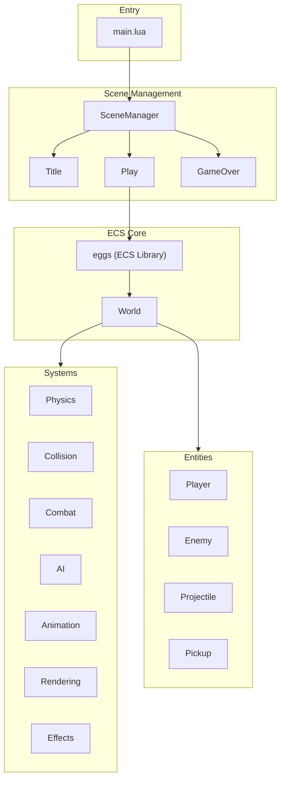

# Pizak - Codebase Architecture

> [!TIP]
> This project uses an AI-maintained [Memory](MEMORY.md) file to track ongoing state and goals.

A Binding of Isaac-inspired game built with Lua on Picotron using an Entity-Component-System (ECS) architecture.

## High-Level Overview



## detailed Documentation

This architecture guide is split into focused sub-documents:

- [**Procedural Generation**](architecture/procedural_generation.md): Dungeon creation, room layouts, and wave patterns.
- [**Collision System**](architecture/collision_system.md): Spatial hashing, bitmask layers, and resolution handlers.
- [**Event System**](architecture/event_bus.md): Pub/Sub communication architecture.
- [**Entity Spawning**](architecture/entity_spawning.md): Factory patterns, lifecycle integration, and spawn logic.
- [**Entity Stats**](architecture/entity_stats.md): Configuration of player, enemies, and projectiles.
- [**Pickup System**](architecture/pickup_system.md): Type Object pattern and effect registry for collectibles.
- [**Rendering System**](architecture/rendering.md): Y-sorting, Z-axis simulation, lighting, and shadows.

## Directory Structure

```text
drive/src/
├── main.lua              # Entry point, simple search paths (lib/, src/)
├── play.lua              # Scene redirect (returns scenes/play)
├── physics.lua           # Namespace redirect (returns physics/init)
├── ai.lua                # Namespace redirect (returns ai/init)
├── lifecycle.lua         # Namespace redirect (returns lifecycle/init)
├── world.lua             # Namespace redirect (returns world/init)
├── utils.lua             # Namespace redirect (returns utils/init)
├── entities.lua          # Namespace redirect (returns entities/init)
├── systems.lua           # Namespace redirect (returns systems/init)
├── scenes.lua            # Namespace redirect (returns scenes/init)
├── ui.lua                # Namespace redirect (returns ui/init)
├── input.lua             # Input handling state and utilities
├── scene_manager.lua     # State machine for scene transitions
├── game/                 # Game configuration, state, and events
├── world/                # World management (Dungeon, Rooms, Layouts)
├── physics/              # Physics & collision module (SpatialGrid, Handlers)
├── ai/                   # AI logic (Primitives + Enemy FSMs)
├── entities/             # Entity factories
├── systems/              # ECS Systems (Movement, Animation, Combat)
├── ui/                   # UI components (Minimap)
└── scenes/               # Game scenes (Title, Play, GameOver)
```

## ECS Architecture

Uses the **eggs** library. The `world` object manages entities (data) and systems (logic).

### Entities

Entities are created via factories in `src/entities/` and are plain Lua tables with components.
**Key Pattern**: "Type Objects" defined in `src/game/game_config.lua` drive the properties of Enemies, Projectiles, and Pickups.

### Systems

Systems iterate over entities with specific tags.
**Key Systems**:

- `physics/collision.lua`: Handles all physical interactions.
- `systems/spawner.lua`: Manages enemy waves and room population.
- `systems/rendering.lua`: Handles Y-sorted rendering, shadows, and lighting.

## Rendering System

The game uses a **Y-sorted 2.5D** rendering approach.

- **Layers**: Background (Floor/Shadows) -> Middleground (Entities) -> Foreground (UI).
- **Z-Axis**: Entities have a `z` property simulating height. `draw_y = y - z`.
- **Lighting**: Palette-swapping spotlight system centered on the player.

## Game Loop

1. **Update**:
    - Input processing
    - AI decision making
    - Physics & Movement integration
    - Collision resolution
    - State updates (Health, Animation FSM)
2. **Draw**:
    - Camera setup (Screen Shake + Scroll)
    - Room floor/walls
    - Background entities (Shadows)
    - Y-Sorted Entity List
    - Lighting/Darkness overlay
    - UI Layer
