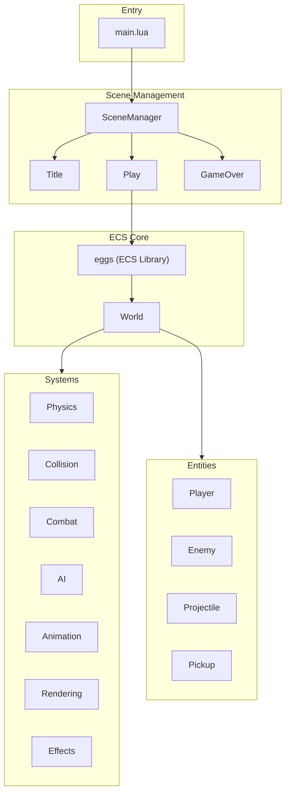

# Pizak - Codebase Architecture

> [!TIP]
> This project uses an AI-maintained [Memory](MEMORY.md) file to track ongoing state and goals.

A Binding of Isaac-inspired game built with Lua on Picotron using an Entity-Component-System (ECS) architecture.

## High-Level Overview



## Directory Structure

```text
drive/src/
├── main.lua              # Entry point, game loop, scene initialization
├── scene_manager.lua     # State machine for scene transitions
├── constants.lua         # Game configuration (sprites, player stats, controls)
├── dungeon/              # World management module
│   ├── dungeon_manager.lua # World generation, map carving, room grid management
│   ├── camera_manager.lua  # Camera following, room centering, and transitions
│   └── room.lua            # Room class (stores bounds, types, and lifecycle FSM)
├── entities/             # Entity factory modules
│   ├── init.lua          # Aggregates all entity factories
│   ├── utils.lua         # Shared helpers: spawning, direction conversion
│   ├── player.lua        # Player entity with movement, health, shooting
│   ├── enemy.lua         # Type Object factory for Skulker, Shooter, Dasher
│   ├── projectile.lua    # Type Object factory for all bullets
│   ├── pickup.lua        # Type Object factory for all collectibles
│   └── shadow.lua        # Shadow entity factory
├── systems/              # ECS system modules
│   ├── init.lua          # Aggregates all systems
│   ├── spawner.lua       # Enemy population and skull timer management
│   ├── physics.lua       # Movement: controllable, acceleration, velocity (sub-pixel)
│   ├── collision.lua     # Entity-entity and entity-map collision resolution
│   ├── handlers.lua      # Collision response handlers (entity-entity, map, tile)
│   ├── combat.lua        # Shooter, health_regen, invulnerability_tick, health_manager
│   ├── ai.lua            # Enemy AI (chase, shoot, dash)
│   ├── animation.lua     # FSM-based animation logic
│   ├── input.lua         # Input reading system
│   ├── rendering.lua     # Sprite drawing, spotlight/shadow, health bars, doors
│   ├── sprite_rotator.lua # Dynamic sprite rotation utility
│   └── effects.lua       # Screen shake, sprite flash, particles, knockback
└── scenes/               # Game scenes (states)
    ├── title.lua         # Title screen
    ├── play.lua          # Main gameplay loop
    └── game_over.lua     # Game over screen
```

## ECS Architecture

Uses the **eggs** library for entity-component system management.

### World

Global `world` object (eggs instance) manages all entities and systems:

- `world.ent(tags, data)` - Create entity with comma-separated component tags
- `world.sys(tags, callback)()` - Execute callback on entities matching tags
- `world.del(entity)` - Delete entity

### Entities

Created via factory functions, each entity is a table with:

- **type**: String identifier (e.g., "Player", "Enemy", "Projectile")
- **Component data**: Properties like `x`, `y`, `vel_x`, `vel_y`, `hp`, `sub_x`, `sub_y` (sub-pixel accumulation), etc.
- **Tags**: Comma-separated list defining which systems process this entity

| Entity | Tags |
|--------|------|
| Player | `player,controllable,map_collidable,collidable,velocity,acceleration,health,shooter,drawable,animatable,spotlight,sprite,shadow,middleground` |
| Enemy | `enemy,velocity,map_collidable,collidable,health,drawable,animatable,sprite,shadow,middleground` |
| Skull | `skull,enemy,velocity,collidable,health,drawable,sprite,shadow,middleground` |
| Projectile | `projectile,velocity,map_collidable,collidable,drawable,animatable,palette_swappable,shadow,middleground` |
| Pickup | `pickup,collidable,drawable,sprite,background` |
| Shadow | `shadow_entity,drawable_shadow,background` |

### Systems

Systems are functions called per-entity based on tag matching:

| System | Tags | Purpose |
|--------|------|---------|
| `read_input` | controllable | Read movement & shoot input, set `dir` & `shoot_dir` |
| `acceleration` | acceleration | Apply acceleration/friction to `vel_x/vel_y` |
| `velocity` | velocity | Apply velocity to position with sub-pixel precision (`sub_x/sub_y`) |
| `resolve_map` | map_collidable,velocity | Stop entities at solid tiles (flag 0) |
| `resolve_entities` | collidable | Detect overlaps, dispatch to handlers |
| `enemy_spawner` | (room hook) | Handle initial population and skull pressure timer |
| `enemy_ai` | enemy | Handle entity behavior (Skulker, Shooter, Dasher, Skull) |
| `update_fsm` | animatable | Manage animation state transitions |
| `animate` | animatable | Calculate sprite from animation config (indices, durations, composite, flips) |
| `shooter` | shooter | Handle projectile firing and ammo cost |
| `health_regen` | health | Passive HP recovery over time |
| `invulnerability_tick` | player | Decrement `invuln_timer` after taking damage |
| `health_manager` | health | Check for `hp <= 0`, handle death effects |
| `sync_shadows` | shadow_entity | Update shadow position and dimensions to match parent |
| `draw_spotlight` | spotlight | Render localized lighting (uses extended palette) |
| `draw_shadow` | drawable_shadow | Render oval shadow beneath entities |
| `draw_layer` | (drawable) | Render entities with sorting options (handles flash) |
| `draw_doors` | (room hook) | Render rotated and stretched blocked door sprites |
| `draw_health_bar` | health | Render segmented 3-state health/ammo bar |

## Animation System

FSM-based animation using [lua-state-machine](https://github.com/kyleconroy/lua-state-machine):

**States**: `idle` → `walking` → `attacking` → `hurt` → `death`

Animation configs are defined in `constants.lua` per entity type, with direction-specific states (`down`, `up`, `left`, `right`) containing frame `indices` and `durations` arrays.

**Features**:

- Per-frame `durations` array for variable timing
- Composite sprites (`top_indices`/`bottom_indices`) with configurable `split_row`
- Direction preserved when idle (velocity-based facing)
- Shooting sets facing direction

## Visual Systems & Palette

The game uses **palette-aware lighting**:

- **Visual Layering**: Entities use ECS tags to define their rendering priority:
  - `background`: Shadows, pickups. Drawn first.
  - `middleground`: Characters and projectiles. Drawn second with **Y-sorting** (depth).
  - `foreground`: UI and health bars. Drawn last.
- **Y-Sorting**: The `middleground` layer uses a custom `qsort` library ([qsort.lua](file:///home/kc00l/game_dev/legendary-octo-guacamole/drive/lib/qsort.lua)) for Picotron-compatible depth sorting, ensuring correct visual overlap.
- **Extended Palette**: Colors 32-63 are initialized as lighter/darker variants of 0-15.
- **Spotlight System**: Uses a custom color table (`0x8000`) to remap background colors to their lighter variants within a radius.
- **Flash Effect**: Replaces all colors with white (7) for a brief duration upon impact.
- **Rotated Door Sprites**: Blocked doors are drawn using `Rendering.draw_doors()` with direction-based rotation (via `sprite_rotator`) and stretching (via `sspr`) to seamlessly connect walls to the room floor.

## Collision System

Uses handler registries for decoupled collision responses:

- **Entity-Entity handlers**: Keyed by `"Type1,Type2"` (e.g., `"Player,Enemy"`). Handle damage, knockback, invulnerability.
- **Entity-Map handlers**: Keyed by entity type (e.g., `"Projectile"`). Handle particles and deletion on wall hits.

## Game Loop (Play Scene)

The Play scene (`src/scenes/play.lua`) manages the game loop and room transitions via `DungeonManager` and `CameraManager`.

### Update Phase

1. **Camera & Spawning**: `camera_manager:update()`, `Systems.Spawner.update()`
2. **Gameplay Systems**:
   - Input & Physics: `read_input` → `acceleration` → `resolve_map` → `velocity`
   - Animation: `update_fsm` → `change_sprite` → `animate`
   - Combat: `projectile_fire` → `enemy_ai` → `resolve_entities`
   - Status: `health_regen` → `invulnerability_tick` → `health_manager` → `sync_shadows`
   - Effects: `update_shake()`

### Draw Phase

1. **Camera Setup**: Apply scroll offset from `camera_manager:get_offset()`
2. **Screen-Space Clip**: Convert room world coordinates to screen coordinates for `clip()`
3. **Layered Rendering**:
   - Background: Shadows, pickups
   - Middleground: Characters and projectiles (Y-sorted)
   - Foreground: Health bars, debug hitboxes (F2)

**Important**: The `clip()` function uses screen coordinates. When camera is offset, world-space room bounds must be converted by subtracting the camera scroll.

## Key Libraries

| Library | Purpose |
|---------|---------|
| `eggs` | ECS entity management |
| `middleclass` | OOP class system |
| `stateful` | State machine for scenes |
| `log` | Debug logging |
| `debugui` | Developer overlay |

## Configuration

All game constants in [constants.lua](drive/src/constants.lua):

- Player stats (health, speed, acceleration, friction)
- Projectile damage and pickup values
- Enemy configurations (Skulker, etc.)
- Controls mapping
- Debug/cheat flags

## Dungeon & Room Management

The game uses a dual-manager system for handling its world:

### DungeonManager

- **Grid-based Layout**: Manages a logical "grid" of rooms (e.g., `0,0`, `-1,0`).
- **Map Carving**: Writes tiles directly to a custom Picotron `userdata` map.
- **World Positioning**: Calculates where rooms sit on the absolute world map.
- **Spawn Logic**: Calculates precise world coordinates for player teleportation between doors.

### CameraManager

- **Smoothing & Transitions**: Handles camera movement and player repositioning during room transitions.
- **Centering**: Automatically centers rooms smaller than the screen.
- **Transition Hook**: Dispatches `on_transition` events to clean up entities (projectiles, pickups) when moving between rooms.

## Technical Details

- **Extended Map**: A `userdata("i16", 256, 256)` is used as the map memory, providing a massive persistent world where rooms are carved at their absolute coordinates.
- **Room Transitions**: When the player's world position exits the current room's pixel bounds (e.g., by entering a door opening), the `CameraManager` calculates the target room based on the player's center position, teleports them to the corresponding entrance, and updates the active room bounds.
- **Room Lifecycle**: Each room has an internal FSM (`populated`, `spawning`, `active`, `cleared`) that controls enemy spawning and door status.
- **Directly Adjacent Rooms**: Following the *The Binding of Isaac* style, rooms are carved at contiguous grid positions (e.g., Room 1 at grid `0,0` and Room 2 at `1,0`). This results in a 2-tile thick wall boundary between rooms, which is pierced by clearing the door tiles in both rooms when they are connected.
- **Skull Pressure Mechanic**: Cleared combat rooms initialize a `SKULL_SPAWN_TIMER` (in `constants.lua`). If the player remains in a cleared room while below max health, a projectile-immune "skull" enemy spawns offscreen at the farthest corner to force progression. The skull can pass through walls (`collidable` but not `map_collidable`).
