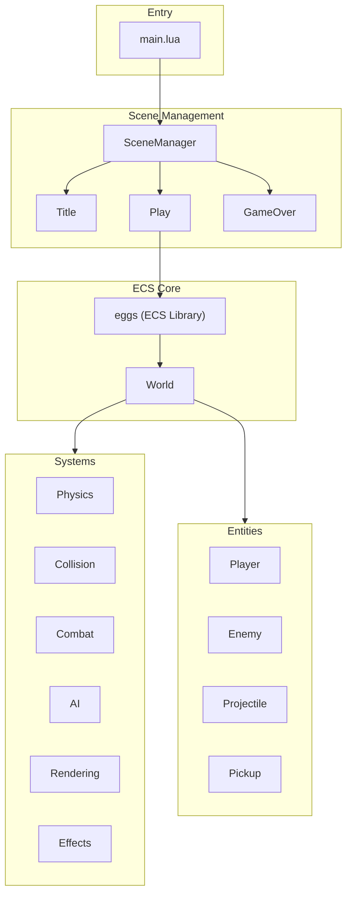

# Pizak - Codebase Architecture

A Binding of Isaac-inspired game built with Lua on Picotron using an Entity-Component-System (ECS) architecture.

## High-Level Overview



## Directory Structure

```
drive/src/
├── main.lua              # Entry point, game loop, scene initialization
├── scene_manager.lua     # State machine for scene transitions
├── constants.lua         # Game configuration (sprites, player stats, controls)
├── entities/             # Entity factory modules
│   ├── init.lua          # Aggregates all entity factories
│   ├── player.lua        # Player entity with movement, health, shooting
│   ├── enemy.lua         # Enemy entities (Skulker type)
│   ├── projectile.lua    # Player bullets
│   └── pickup.lua        # Health recovery pickups
├── systems/              # ECS system modules
│   ├── init.lua          # Aggregates all systems
│   ├── physics.lua       # Movement: controllable, acceleration, velocity
│   ├── collision.lua     # Entity-entity and entity-map collision resolution
│   ├── combat.lua        # Shooter, health_regen, health_manager, death handlers
│   ├── ai.lua            # Enemy AI (chase player)
│   ├── rendering.lua     # Sprite drawing, spotlight/shadow, animation, health bars
│   └── effects.lua       # Screen shake, sprite flash, particles, hit/death effects
└── scenes/               # Game scenes (states)
    ├── title.lua         # Title screen
    ├── play.lua          # Main gameplay loop
    └── game_over.lua     # Game over screen
```

## ECS Architecture

Uses the **eggs** library for entity-component system management.

### World

Global `world` object (eggs instance) manages all entities and systems:
- `world.ent(tags, data)` - Create entity with comma-separated component tags
- `world.sys(tags, callback)()` - Execute callback on entities matching tags
- `world.del(entity)` - Delete entity

### Entities

Created via factory functions, each entity is a table with:
- **type**: String identifier (e.g., "Player", "Enemy", "Projectile")
- **Component data**: Properties like `x`, `y`, `vel_x`, `vel_y`, `hp`, etc.
- **Tags**: Comma-separated list defining which systems process this entity

| Entity | Tags |
|--------|------|
| Player | `player,controllable,collidable,velocity,acceleration,health,shooter,drawable,animatable,shadow,spotlight,sprite` |
| Enemy | `enemy,velocity,collidable,drawable,sprite,health` |
| Projectile | `projectile,velocity,collidable,drawable,sprite` |
| Pickup | `collidable,drawable,sprite` |

### Systems

Systems are functions called per-entity based on tag matching:

| System | Tags | Purpose |
|--------|------|---------|
| `controllable` | controllable | Read input, set `dir_x/dir_y` |
| `acceleration` | acceleration | Apply acceleration/friction to velocity |
| `velocity` | velocity | Apply velocity to position with sub-pixel precision |
| `resolve_map_collisions` | collidable,velocity | Stop entities at solid tiles |
| `resolve_entity_collisions` | collidable | Detect overlaps, dispatch to handlers |
| `enemy_ai` | enemy | Move enemies toward player |
| `shooter` | shooter | Handle projectile firing |
| `health_regen` | health | Passive HP recovery |
| `health_manager` | health | Check for death, dispatch to handlers |
| `animatable` | animatable | Update sprite animation frames |
| `drawable` | drawable | Render sprites |
| `draw_spotlight` | spotlight | Render lighting effect |
| `draw_shadow` | shadow | Render entity shadow |

## Collision System

Uses handler registries for decoupled collision responses:

```lua
-- Entity-Entity handlers (keyed by "Type1,Type2")
CollisionHandlers.entity["Player,Enemy"] = function(player, enemy) ... end
CollisionHandlers.entity["Projectile,Enemy"] = function(projectile, enemy) ... end

-- Entity-Map handlers (keyed by entity type)
CollisionHandlers.map["Projectile"] = function(projectile, map_x, map_y) ... end
```

## Game Loop (Play Scene)

```lua
function Play:update()
    -- Input
    world.sys("controllable", Systems.controllable)()
    
    -- Physics
    world.sys("acceleration", Systems.acceleration)()
    world.sys("collidable,velocity", Systems.resolve_map_collisions)()
    world.sys("velocity", Systems.velocity)()
    
    -- Animation & Combat
    world.sys("animatable", Systems.animatable)()
    world.sys("shooter", Systems.shooter)()
    world.sys("sprite", Systems.change_sprite)()
    
    -- AI & Collisions
    world.sys("enemy", Systems.enemy_ai)()
    world.sys("collidable", Systems.resolve_entity_collisions)()
    
    -- Health
    world.sys("health", Systems.health_regen)()
    world.sys("health", Systems.health_manager)()
    
    -- Effects
    Systems.Effects.update_shake()
end
```

## Key Libraries

| Library | Purpose |
|---------|---------|
| `eggs` | ECS entity management |
| `middleclass` | OOP class system |
| `stateful` | State machine for scenes |
| `log` | Debug logging |
| `debugui` | Developer overlay |

## Configuration

All game constants in [constants.lua](file:///home/kc00l/game_dev/legendary-octo-guacamole/drive/src/constants.lua):
- Player stats (health, speed, regen)
- Projectile damage
- Enemy configs (per-type: hp, speed, damage)
- Controls mapping
- Debug/cheat flags
