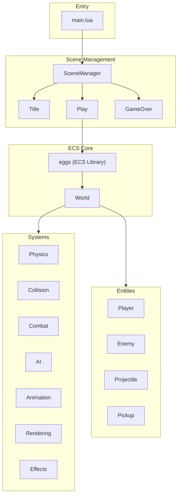

# Pizak - Codebase Architecture

> [!TIP]
> This project uses an AI-maintained [Memory](MEMORY.md) file to track ongoing state and goals.

A Binding of Isaac-inspired game built with Lua on Picotron using an Entity-Component-System (ECS) architecture.

## High-Level Overview



## Directory Structure

```text
drive/src/
├── main.lua              # Entry point, simple search paths (lib/, src/)
├── play.lua              # Scene redirect (returns scenes/play)
├── physics.lua           # Namespace redirect (returns physics/init)
├── ai.lua                # Namespace redirect (returns ai/init)
├── lifecycle.lua         # Namespace redirect (returns lifecycle/init)
├── world.lua             # Namespace redirect (returns world/init)
├── utils.lua             # Namespace redirect (returns utils/init)
├── entities.lua          # Namespace redirect (returns entities/init)
├── systems.lua           # Namespace redirect (returns systems/init)
├── scene_manager.lua     # State machine for scene transitions
├── game/                 # Game configuration, state, and events
│   ├── init.lua          # Aggregator (Config, State, Events)
│   ├── game_config.lua   # Immutable game configuration
│   ├── game_state.lua    # Mutable runtime state (cheats, debug)
│   └── events.lua        # Pub/sub event system
├── world/                # World management module
│   ├── init.lua          # World aggregator
│   ├── dungeon_manager.lua # World generation, map carving, room grid
│   ├── camera_manager.lua  # Camera following and transitions
│   ├── room.lua            # Room class and lifecycle FSM
│   ├── room_renderer.lua   # Room rendering: door masking, void coverage
│   └── wave_patterns.lua   # Isaac-style enemy spawn patterns (DSL)
├── physics/              # Physics & collision module
│   ├── init.lua          # Physics aggregator
│   ├── collision.lua     # Main collision logic
│   ├── spatial_grid.lua  # Spatial broad-phase
│   ├── collision_filter.lua # Bitmasking layer checks
│   └── handlers.lua      # Collision response handlers
├── ai/                   # AI logic (primitives + enemy profiles)
│   ├── init.lua          # AI aggregator + dispatch
│   ├── primitives/       # Stateless, reusable movement helpers
│   │   ├── wander.lua    # Random destination seeking
│   │   └── chase.lua     # Move toward/away/maintain distance
│   └── enemies/          # Per-enemy-type FSM controllers
│       ├── skulker.lua   # FSM: wander ↔ chase ↔ puzzled
│       ├── skull.lua     # Simple: always chase
│       ├── shooter.lua   # FSM: wander ↔ engage ↔ puzzled
│       └── dasher.lua    # FSM: patrol → windup → dash → stun
├── entities/             # Entity factory module
│   ├── init.lua          # Entities aggregator
│   ├── player.lua
│   ├── enemy.lua         # Type Object factory (Skulker, Shooter, etc)
│   ├── projectile.lua    # Type Object factory (all bullets)
│   ├── pickup.lua        # Type Object factory (all collectibles)
│   └── shadow.lua
├── utils/                # Utility module
│   ├── init.lua          # Utils aggregator
│   ├── hitbox_utils.lua
│   └── entity_utils.lua
├── systems/              # ECS system module
│   ├── init.lua          # Systems aggregator
│   ├── spawner.lua
│   ├── physics.lua       # Movement: controllable, acceleration, velocity
│   ├── ai.lua            # AI system dispatcher
│   ├── shooter.lua       # Generic shooter system (shooter tag)
│   ├── timers.lua        # Generic countdown system (timers tag)
│   ├── health_regen.lua  # Generic health recovery (health_regen tag)
│   ├── animation.lua     # FSM-based animation logic
│   ├── input.lua         # Input reading system
│   ├── rendering.lua     # Sprite drawing, spotlight, UI
│   ├── sprite_rotator.lua
│   ├── emotions.lua
│   └── effects.lua       # Shake, flash, particles, knockback
├── ui/                   # UI module
│   ├── init.lua          # UI aggregator
│   └── minimap.lua       # Isaac-style minimap (rooms, icons, smart rotation)
└── scenes/               # Game scene module
    ├── init.lua          # Scenes aggregator
    ├── title.lua
    ├── play.lua
    └── game_over.lua
```

## ECS Architecture

Uses the **eggs** library for entity-component system management.

### World

Global `world` object (eggs instance) manages all entities and systems:

- `world.ent(tags, data)` - Create entity with comma-separated component tags
- `world.sys(tags, callback)()` - Execute callback on entities matching tags
- `world.del(entity)` - Delete entity

### Entities

Created via factory functions, each entity is a table with:

- **type**: String identifier (e.g., "Player", "Enemy", "Projectile")
- **Component data**: Properties like `x`, `y`, `vel_x`, `vel_y`, `hp`, `sub_x`, `sub_y` (sub-pixel accumulation), etc.
- **Tags**: Comma-separated list defining which systems process this entity

| Entity | Tags |
| :--- | :--- |
| Player | `player,controllable,map_collidable,collidable,velocity,acceleration,health,shooter,drawable,animatable,spotlight,sprite,shadow,middleground` |
| Enemy | `enemy,velocity,map_collidable,collidable,health,drawable,animatable,sprite,shadow,middleground` |
| Skull | `skull,enemy,velocity,collidable,health,drawable,sprite,shadow,middleground` |
| Projectile | `projectile,velocity,map_collidable,collidable,drawable,animatable,palette_swappable,shadow,middleground` |
| Pickup | `pickup,collidable,drawable,sprite,background` |
| Shadow | `shadow_entity,drawable_shadow,background` |

### Systems

Systems are functions called per-entity based on tag matching:

| System | Tags | Purpose |
| :--- | :--- | :--- |
| `read_input` | controllable | Read movement & shoot input, set `dir` & `shoot_dir` |
| `acceleration` | acceleration | Apply acceleration/friction to `vel_x/vel_y` |
| `velocity` | velocity | Apply velocity to position with sub-pixel precision (`sub_x/sub_y`) |
| `z_axis` | velocity | Simulate Z-height and gravity (`z`, `vel_z`, `gravity_z`), handles ground impact |
| `resolve_map` | map_collidable,velocity | Stop entities at solid tiles (flag 0) |
| `resolve_entities` | collidable | Detect overlaps, dispatch to handlers |
| `enemy_spawner` | (room hook) | Handle initial population and skull pressure timer |
| `ai` | enemy | AI dispatcher (delegates to behaviors in `src/ai/`) |
| `update_fsm` | animatable | Manage animation state transitions |
| `animate` | animatable | Calculate sprite from animation config (indices, durations, composite, flips) |
| `shooter` | shooter | Handle projectile firing and ammo cost |
| `health_regen` | health | Passive HP recovery over time |
| `invulnerability_tick` | player | Decrement `invuln_timer` after taking damage |
| `health_manager` | health | Check for `hp <= 0`, handle death effects |
| `sync_shadows` | shadow_entity | Update shadow position and dimensions to match parent |
| `draw_spotlight` | spotlight | Render localized lighting (uses extended palette) |
| `draw_shadow` | drawable_shadow | Render oval shadow beneath entities |
| `draw_layer` | (drawable) | Render entities with sorting options (handles flash) |
| `draw_doors` | (room hook) | Render rotated and stretched blocked door sprites |
| `draw_health_bar` | health | Render segmented 3-state health/ammo bar |

## Animation System

FSM-based animation using [lua-state-machine](https://github.com/kyleconroy/lua-state-machine):

**States**: `idle` → `walking` → `attacking` → `hurt` → `death`

Animation configs are defined in `constants.lua` per entity type, with direction-specific states (`down`, `up`, `left`, `right`) containing frame `indices` and `durations` arrays.

**Features**:

- Per-frame `durations` array for variable timing
- Composite sprites (`top_indices`/`bottom_indices`) with configurable `split_row`
- Direction preserved when idle (velocity-based facing)
- Shooting sets facing direction

## Visual Systems & Palette

The game uses **palette-aware lighting**:

- **Visual Layering**: Entities use ECS tags to define their rendering priority:
  - `background`: Shadows, pickups. Drawn first.
  - `middleground`: Characters and projectiles. Drawn second with **Y-sorting** (depth).
  - `foreground`: UI and health bars. Drawn last.
- **Y-Sorting**: The `middleground` layer uses a custom `qsort` library ([qsort.lua](file:///home/kc00l/game_dev/legendary-octo-guacamole/drive/lib/qsort.lua)) for Picotron-compatible depth sorting, ensuring correct visual overlap.
- **Extended Palette**: Colors 32-63 are initialized as lighter/darker variants of 0-15.
- **Spotlight System**: Uses a custom color table (`0x8000`) to remap background colors to their lighter variants within a radius.
- **Flash Effect**: Replaces all colors with white (7) for a brief duration upon impact.
- **Rotated Door Sprites**: Blocked doors are drawn using `Rendering.draw_doors()` with direction-based rotation (via `sprite_rotator`) and stretching (via `sspr`) to seamlessly connect walls to the room floor.

## Collision System

Uses handler registries for decoupled collision responses:

- **Entity-Entity handlers**: Keyed by `"Type1,Type2"` (e.g., `"Player,Enemy"`). Handle damage, knockback, invulnerability.
- **Entity-Map handlers**: Keyed by entity type (e.g., `"Projectile"`). Handle particles and deletion on wall hits.

## Player Stats System

Decouples combat statistics from static projectile definitions to enable dynamic builds and powerup synergies.

- **Ownership**: Combat stats (`shot_speed`, `damage`, `range`, `knockback`, `fire_rate`) are owned by the `Player` entity, not the projectile config.
- **Dynamic Damage & Cost**: Damage is calculated as `max_hp * max_hp_to_damage_ratio`. Shot cost is `max_hp * max_hp_to_shot_cost_ratio`.
- **Inheritance**: `Projectile.spawn` accepts an `instance_data` table. The `Shooter` system passes the player's *current* stats into this table when firing, ensuring bullets reflect the player's state at the moment of shooting.
- **Inventory**: Player entity tracks `coins`, `keys`, and `bombs`.

## Game Loop (Play Scene)

The Play scene (`src/scenes/play.lua`) manages the game loop and room transitions via `DungeonManager` and `CameraManager`.

### Update Phase

1. **Camera & Spawning**: `camera_manager:update()`, `Systems.Spawner.update()`
2. **Gameplay Systems**:
   - Input & Physics: `read_input` → `acceleration` → `resolve_map` → `velocity`
   - Animation: `update_fsm` → `change_sprite` → `animate`
   - Combat: `projectile_fire` → `ai` → `resolve_entities`
   - Status: `health_regen` → `invulnerability_tick` → `health_manager` → `sync_shadows`
   - Effects: `update_shake()`

### Draw Phase

1. **Camera Setup**: Apply scroll offset from `camera_manager:get_offset()`
2. **Screen-Space Clip**: Convert room world coordinates to screen coordinates for `clip()`
3. **Layered Rendering**:
   - Background: Shadows, pickups
   - Middleground: Characters and projectiles (Y-sorted)
   - Foreground: Health bars, debug hitboxes (F2)

**Important**: The `clip()` function uses screen coordinates. When camera is offset, world-space room bounds must be converted by subtracting the camera scroll.

## Key Libraries

| Library | Purpose |
| :--- | :--- |
| `eggs` | ECS entity management |
| `middleclass` | OOP class system |
| `stateful` | State machine for scenes |
| `log` | Debug logging |
| `debugui` | Developer overlay |

## Configuration

All game constants in [constants.lua](drive/src/constants.lua):

- Player stats (health, speed, acceleration, friction)
- Projectile damage and pickup values
- Enemy configurations (Skulker, etc.)
- Controls mapping
- Debug/cheat flags

## Dungeon & Room Management

The game uses a dual-manager system for handling its world:

### DungeonManager

- **Grid-based Layout**: Manages a logical "grid" of rooms (e.g., `0,0`, `-1,0`).
- **Map Carving**: Writes tiles directly to a custom Picotron `userdata` map.
- **World Positioning**: Calculates where rooms sit on the absolute world map.
- **Spawn Logic**: Calculates precise world coordinates for player teleportation between doors.
- **Room Clear Hook**: Dispatches `on_room_clear(room)` when all enemies in a room are defeated. Used by `play.lua` to heal the player by 1 segment.

### WavePatterns (Positional DSL)

Enemy spawning uses a positional DSL defined in `wave_patterns.lua`:

```lua
-- Legend: S=Skulker, H=Shooter, D=Dasher, .=empty
ambush = {
   difficulty = 2,
   grid = {
      "S . . . S",
      ". . H . .",
      "S . . . S",
   }
}
```

- **Grid Mapping**: ASCII grids are normalized to room inner bounds.
- **Difficulty Scaling**: Rooms select patterns based on distance from start (1-2=easy, 3-4=medium, 5+=hard).
- **API**: `WavePatterns.get_random_pattern(difficulty)` returns a pattern for room assignment.

### CameraManager

- **Smoothing & Transitions**: Handles camera movement and player repositioning during room transitions.
- **Centering**: Automatically centers rooms smaller than the screen.

### Event System (Pub/Sub)

Cross-system communication uses a centralized pub/sub event system via `Events` module (wrapper around [beholder.lua](file:///home/kc00l/game_dev/pizak/lib/beholder.lua/beholder.lua)):

```lua
-- Event Constants (typed, not strings)
Events.ROOM_CLEAR      -- Fired when all enemies in a room are defeated
Events.ROOM_TRANSITION -- Fired when player transitions to a new room

-- Subscribing (in play.lua enteredState)
Events.on(Events.ROOM_CLEAR, function(room)
   player.hp = min(player.hp + player.max_hp / 5, player.max_hp)
end)

-- Emitting (in DungeonManager/CameraManager)
Events.emit(Events.ROOM_CLEAR, room)

-- Cleanup (in play.lua exitedState)
Events.reset()
```

## Technical Details

- **Extended Map**: A `userdata("i16", 256, 256)` is used as the map memory, providing a massive persistent world where rooms are carved at their absolute coordinates.
- **Room Transitions**: When the player's world position exits the current room's pixel bounds (e.g., by entering a door opening), a transition is triggered. The `CameraManager` enters a `Scrolling` state, teleports the player to the entrance of the target room, and smoothly interpolates the camera position from the old room to the new one over 30 frames. During this scroll, both rooms are rendered to the screen. Once complete, the camera returns to its `Following` (clamping) state and the target room becomes the new active room.
- **Room Lifecycle**: Each room has an internal FSM (`populated`, `spawning`, `active`, `cleared`) that controls enemy spawning and door status.
- **Directly Adjacent Rooms**: Following the *The Binding of Isaac* style, rooms are carved at contiguous grid positions (e.g., Room 1 at grid `0,0` and Room 2 at `1,0`). This results in a 2-tile thick wall boundary between rooms, which is pierced by clearing the door tiles in both rooms when they are connected.
- **Skull Pressure Mechanic**: Cleared combat rooms initialize a `SKULL_SPAWN_TIMER` (in `constants.lua`). If the player remains in a cleared room while below max health, a projectile-immune "skull" enemy spawns offscreen at the farthest corner to force progression. The skull can pass through walls (`collidable` but not `map_collidable`).
- **Z-Axis Physics**: Projectiles simulate 3D height using `z`, `vel_z`, and `gravity_z` components. The **Physics** system updates these independently of the X/Y logical position.
  - **Visuals**: `Rendering.draw_sprite` subtracts `z` from the Y coordinate (`sy = y - z`), creating a 2.5D "lofted" look. `Projectile.spawn` accounts for this by aligning the visual center with the shooter's aim (chest height).
  - **Z-Height Inheritance**: `ProjectilePickup` inherits the Z-height of its parent projectile and uses gravity (`velocity` tag) to fall naturally if spawned in mid-air (e.g., hitting a wall).
  - **Mechanics**: Projectiles have a "delayed gravity" mechanic where they fly horizontally for 75% of their lifetime, then arc down in the final 25%.
  - **Ground Impact**: When `z <= 0`, the entity hits the ground. For player projectiles, this spawns a randomized `ProjectilePickup` (chance for hearts) and destroys the projectile.
- **Module Path Resolution**: The game uses a custom `require` implementation (see `lib/require.lua`) that allows loading modules by name without specifying their subdirectory. Root directories for module resolution (e.g., `src/systems/`, `src/ai/`, `src/physics/`, `src/utils/`, `src/world/`) are configured in `src/main.lua` via `add_module_path()`. This keeps `require` statements clean and decoupled from the internal folder structure.
