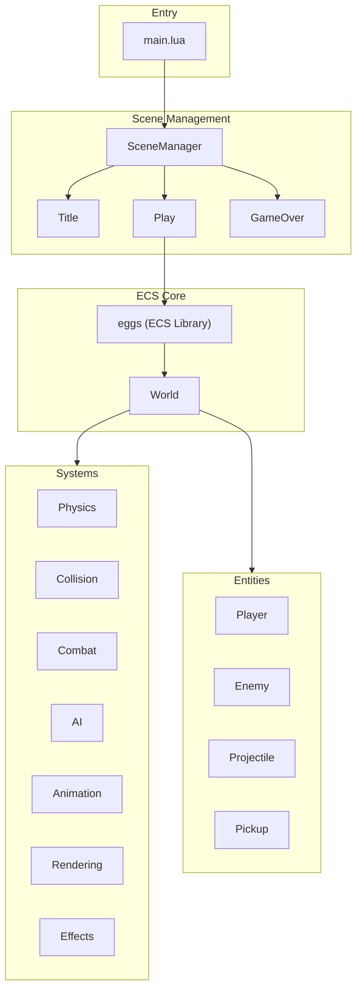

# Pizak - Codebase Architecture

> [!TIP]
> This project uses an AI-maintained [Memory](MEMORY.md) file to track ongoing state and goals.

A Binding of Isaac-inspired game built with Lua on Picotron using an Entity-Component-System (ECS) architecture.

## High-Level Overview



## Directory Structure

```
drive/src/
├── main.lua              # Entry point, game loop, scene initialization
├── scene_manager.lua     # State machine for scene transitions
├── constants.lua         # Game configuration (sprites, player stats, controls)
├── entities/             # Entity factory modules
│   ├── init.lua          # Aggregates all entity factories
│   ├── player.lua        # Player entity with movement, health, shooting
│   ├── enemy.lua         # Enemy entities (Skulker type)
│   ├── projectile.lua    # Player bullets
│   └── pickup.lua        # Health recovery/ammo pickups
├── systems/              # ECS system modules
│   ├── init.lua          # Aggregates all systems
│   ├── physics.lua       # Movement: controllable, acceleration, velocity (sub-pixel)
│   ├── collision.lua     # Entity-entity and entity-map collision resolution
│   ├── combat.lua        # Shooter, health_regen, invulnerability_tick, health_manager
│   ├── ai.lua            # Enemy AI (chase player)
│   ├── rendering.lua     # Sprite drawing, spotlight/shadow, palette lighting, health bars
│   └── effects.lua       # Screen shake, sprite flash, particles, knockback
└── scenes/               # Game scenes (states)
    ├── title.lua         # Title screen
    ├── play.lua          # Main gameplay loop
    └── game_over.lua     # Game over screen
```

## ECS Architecture

Uses the **eggs** library for entity-component system management.

### World

Global `world` object (eggs instance) manages all entities and systems:
- `world.ent(tags, data)` - Create entity with comma-separated component tags
- `world.sys(tags, callback)()` - Execute callback on entities matching tags
- `world.del(entity)` - Delete entity

### Entities

Created via factory functions, each entity is a table with:
- **type**: String identifier (e.g., "Player", "Enemy", "Projectile")
- **Component data**: Properties like `x`, `y`, `vel_x`, `vel_y`, `hp`, `sub_x`, `sub_y` (sub-pixel accumulation), etc.
- **Tags**: Comma-separated list defining which systems process this entity

| Entity | Tags |
|--------|------|
| Player | `player,controllable,collidable,velocity,acceleration,health,shooter,drawable,animatable,shadow,spotlight,sprite` |
| Enemy | `enemy,velocity,acceleration,collidable,drawable,sprite,health,shadow` |
| Projectile | `projectile,velocity,collidable,drawable,sprite` |
| Pickup | `collidable,drawable,sprite` |

### Systems

Systems are functions called per-entity based on tag matching:

| System | Tags | Purpose |
|--------|------|---------|
| `controllable` | controllable | Read input, set `dir_x/dir_y` |
| `acceleration` | acceleration | Apply acceleration/friction to `vel_x/vel_y` |
| `velocity` | velocity | Apply velocity to position with sub-pixel precision (`sub_x/sub_y`) |
| `resolve_map_collisions` | collidable,velocity | Stop entities at solid tiles (flag 0) |
| `resolve_entity_collisions` | collidable | Detect overlaps, dispatch to handlers |
| `change_sprite` | sprite | Update `sprite_index` based on direction (skips FSM entities) |
| `update_fsm` | animatable | FSM state transitions (idle/walking/attacking/hurt/death) |
| `animate` | animatable | Calculate sprite from animation config (indices, durations, composite) |
| `shooter` | shooter | Handle projectile firing and ammo cost |
| `health_regen` | health | Passive HP recovery over time |
| `invulnerability_tick` | player | Decrement `invuln_timer` after taking damage |
| `health_manager` | health | Check for `hp <= 0`, handle death effects |
| `draw_spotlight` | spotlight | Render localized lighting (uses extended palette) |
| `draw_shadow` | shadow | Render oval shadow beneath entities |
| `drawable` | drawable | Render the entity sprite (handles flashing) |
| `draw_health_bar` | health | Render segmented 3-state health/ammo bar |

## Animation System

FSM-based animation using [lua-state-machine](https://github.com/kyleconroy/lua-state-machine):

**States**: `idle` → `walking` → `attacking` → `hurt` → `death`

**Animation Config** (in `constants.lua`):
```lua
animations = {
   down = {
      idle = {indices = {238, 239}, durations = {30, 30}},
      walking = {top_indices = {240}, bottom_indices = {240, 255}, durations = {8, 8}, split_row = 9},
      attacking = {indices = {241, 242}, durations = {15, 15}}
   }
}
```

**Features**:
- Per-frame `durations` array for variable timing
- Composite sprites (`top_indices`/`bottom_indices`) with configurable `split_row`
- Direction preserved when idle (velocity-based facing)
- Shooting sets facing direction

## Visual Systems & Palette

The game uses **palette-aware lighting**:
- **Extended Palette**: Colors 32-63 are initialized as lighter/darker variants of 0-15.
- **Spotlight System**: Uses a custom color table (`0x8000`) to remap background colors to their lighter variants within a radius.
- **Flash Effect**: Replaces all colors with white (7) for a brief duration upon impact.

## Collision System

Uses handler registries for decoupled collision responses:

```lua
-- Entity-Entity handlers (keyed by "Type1,Type2")
CollisionHandlers.entity["Player,Enemy"] = function(player, enemy)
    -- Handle damage, knockback, invulnerability
end

-- Entity-Map handlers (keyed by entity type)
CollisionHandlers.map["Projectile"] = function(projectile, map_x, map_y)
    -- Particles and deletion
end
```

## Game Loop (Play Scene)

```lua
function Play:update()
    -- Input & Physics
    world.sys("controllable", Systems.controllable)()
    world.sys("acceleration", Systems.acceleration)()
    world.sys("collidable,velocity", Systems.resolve_map_collisions)()
    world.sys("velocity", Systems.velocity)()
    
    -- Visuals & Combat
    world.sys("sprite", Systems.change_sprite)()
    world.sys("animatable", Systems.animatable)()
    world.sys("shooter", Systems.shooter)()
    
    -- AI & Collisions
    world.sys("enemy", Systems.enemy_ai)()
    world.sys("collidable", Systems.resolve_entity_collisions)()
    
    -- Health & Invulnerability
    world.sys("health", Systems.health_regen)()
    world.sys("player", Systems.invulnerability_tick)()
    world.sys("health", Systems.health_manager)()
    
    -- Global Effects
    Systems.Effects.update_shake()
end

function Play:draw()
    cls(0)
    Systems.reset_spotlight() -- Ensure color table is clean
    
    -- Layered Rendering
    world.sys("spotlight", function(e) Systems.draw_spotlight(e, ROOM_CLIP) end)()
    world.sys("shadow", function(e) Systems.draw_shadow(e, ROOM_CLIP) end)()
    
    world.sys("drawable", function(entity)
        Systems.Effects.update_flash(entity)
        Systems.drawable(entity)
        pal(0) -- Reset palette per-entity if used
    end)()
    
    world.sys("health", Systems.draw_health_bar)()
end
```

## Key Libraries

| Library | Purpose |
|---------|---------|
| `eggs` | ECS entity management |
| `middleclass` | OOP class system |
| `stateful` | State machine for scenes |
| `log` | Debug logging |
| `debugui` | Developer overlay |

## Configuration

All game constants in [constants.lua](drive/src/constants.lua):
- Player stats (health, speed, acceleration, friction)
- Projectile damage and pickup values
- Enemy configurations (Skulker, etc.)
- Controls mapping
- Debug/cheat flags
