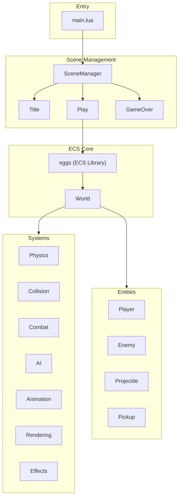

# Pizak - Codebase Architecture

> [!TIP]
> This project uses an AI-maintained [Memory](MEMORY.md) file to track ongoing state and goals.

A Binding of Isaac-inspired game built with Lua on Picotron using an Entity-Component-System (ECS) architecture.

## High-Level Overview



## Directory Structure

```text
drive/src/
├── main.lua              # Entry point, game loop, scene initialization
├── scene_manager.lua     # State machine for scene transitions
├── constants.lua         # Game configuration (sprites, player stats, controls)
├── dungeon/              # World management module
│   ├── dungeon_manager.lua # World generation, map carving, room grid management
│   ├── room_manager.lua    # Room state machine (Exploring, Scrolling, Settling)
│   └── room.lua            # Room class (stores bounds, types, and logic)
├── entities/             # Entity factory modules
│   ├── init.lua          # Aggregates all entity factories
│   ├── player.lua        # Player entity with movement, health, shooting
│   ├── enemy.lua         # Enemy entities (Skulker type)
│   ├── projectile.lua    # Player bullets
│   └── pickup.lua        # Health recovery/ammo pickups
├── systems/              # ECS system modules
│   ├── init.lua          # Aggregates all systems
│   ├── physics.lua       # Movement: controllable, acceleration, velocity (sub-pixel)
│   ├── collision.lua     # Entity-entity and entity-map collision resolution
│   ├── combat.lua        # Shooter, health_regen, invulnerability_tick, health_manager
│   ├── ai.lua            # Enemy AI (chase player)
│   ├── rendering.lua     # Sprite drawing, spotlight/shadow, palette lighting, health bars
│   └── effects.lua       # Screen shake, sprite flash, particles, knockback
└── scenes/               # Game scenes (states)
    ├── title.lua         # Title screen
    ├── play.lua          # Main gameplay loop
    └── game_over.lua     # Game over screen
```

## ECS Architecture

Uses the **eggs** library for entity-component system management.

### World

Global `world` object (eggs instance) manages all entities and systems:

- `world.ent(tags, data)` - Create entity with comma-separated component tags
- `world.sys(tags, callback)()` - Execute callback on entities matching tags
- `world.del(entity)` - Delete entity

### Entities

Created via factory functions, each entity is a table with:

- **type**: String identifier (e.g., "Player", "Enemy", "Projectile")
- **Component data**: Properties like `x`, `y`, `vel_x`, `vel_y`, `hp`, `sub_x`, `sub_y` (sub-pixel accumulation), etc.
- **Tags**: Comma-separated list defining which systems process this entity

| Entity | Tags |
|--------|------|
| Player | `player,controllable,collidable,velocity,acceleration,health,shooter,drawable,animatable,spotlight,sprite,middleground` |
| Enemy | `enemy,velocity,acceleration,collidable,drawable,sprite,health,middleground` |
| Projectile | `projectile,velocity,collidable,drawable,sprite,middleground` |
| Pickup | `collidable,drawable,sprite,background` |
| Shadow | `shadow_entity,drawable_shadow,background` |

### Systems

Systems are functions called per-entity based on tag matching:

| System | Tags | Purpose |
|--------|------|---------|
| `read_input` | controllable | Read movement & shoot input, set `dir` & `shoot_dir` |
| `acceleration` | acceleration | Apply acceleration/friction to `vel_x/vel_y` |
| `velocity` | velocity | Apply velocity to position with sub-pixel precision (`sub_x/sub_y`) |
| `resolve_map` | collidable,velocity | Stop entities at solid tiles (flag 0) |
| `resolve_entities` | collidable | Detect overlaps, dispatch to handlers |
| `change_sprite` | sprite | Update `sprite_index` based on direction (skips FSM entities) |
| `update_fsm` | animatable | FSM state transitions (idle/walking/attacking/hurt/death) |
| `animate` | animatable | Calculate sprite from animation config (indices, durations, composite) |
| `shooter` | shooter | Handle projectile firing and ammo cost (input moved to `read_input`) |
| `health_regen` | health | Passive HP recovery over time |
| `invulnerability_tick` | player | Decrement `invuln_timer` after taking damage |
| `health_manager` | health | Check for `hp <= 0`, handle death effects |
| `draw_spotlight` | spotlight | Render localized lighting (uses extended palette) |
| `draw_shadow` | shadow | Render oval shadow beneath entities |
| `draw_layer` | (drawable) | Render entities with sorting options (handles flash) |
| `draw_health_bar` | health | Render segmented 3-state health/ammo bar |

## Animation System

FSM-based animation using [lua-state-machine](https://github.com/kyleconroy/lua-state-machine):

**States**: `idle` → `walking` → `attacking` → `hurt` → `death`

Animation configs are defined in `constants.lua` per entity type, with direction-specific states (`down`, `up`, `left`, `right`) containing frame `indices` and `durations` arrays.

**Features**:

- Per-frame `durations` array for variable timing
- Composite sprites (`top_indices`/`bottom_indices`) with configurable `split_row`
- Direction preserved when idle (velocity-based facing)
- Shooting sets facing direction

## Visual Systems & Palette

The game uses **palette-aware lighting**:

- **Visual Layering**: Entities use ECS tags to define their rendering priority:
  - `background`: Shadows, pickups. Drawn first.
  - `middleground`: Characters and projectiles. Drawn second with **Y-sorting** (depth).
  - `foreground`: UI and health bars. Drawn last.
- **Y-Sorting**: The `middleground` layer uses a custom `qsort` library ([qsort.lua](file:///home/kc00l/game_dev/legendary-octo-guacamole/drive/lib/qsort.lua)) for Picotron-compatible depth sorting, ensuring correct visual overlap.
- **Extended Palette**: Colors 32-63 are initialized as lighter/darker variants of 0-15.
- **Spotlight System**: Uses a custom color table (`0x8000`) to remap background colors to their lighter variants within a radius.
- **Flash Effect**: Replaces all colors with white (7) for a brief duration upon impact.

## Collision System

Uses handler registries for decoupled collision responses:

- **Entity-Entity handlers**: Keyed by `"Type1,Type2"` (e.g., `"Player,Enemy"`). Handle damage, knockback, invulnerability.
- **Entity-Map handlers**: Keyed by entity type (e.g., `"Projectile"`). Handle particles and deletion on wall hits.

## Game Loop (Play Scene)

The Play scene (`src/scenes/play.lua`) uses a `RoomManager` state machine to manage room transitions.

### Update Phase

1. **Room State Management**: `room_manager:update()` delegates to current state
2. **Gameplay Systems** (only when `isExploring()`):
   - Input & Physics: `read_input` → `acceleration` → `resolve_map` → `velocity`
   - Animation: `update_fsm` → `change_sprite` → `animate`
   - Combat: `projectile_fire` → `enemy_ai` → `resolve_entities`
   - Status: `health_regen` → `invulnerability_tick` → `health_manager` → `sync_shadows`
   - Effects: `update_shake()`

### Draw Phase

1. **Camera Setup**: Apply scroll offset from `room_manager:getCameraOffset()`
2. **Screen-Space Clip**: Convert room world coordinates to screen coordinates for `clip()`
3. **Layered Rendering**:
   - Background: Shadows, pickups
   - Middleground: Characters and projectiles (Y-sorted)
   - Foreground: Health bars, debug hitboxes (F2)

**Important**: The `clip()` function uses screen coordinates. When camera is offset, world-space room bounds must be converted by subtracting the camera scroll.

## Key Libraries

| Library | Purpose |
|---------|---------|
| `eggs` | ECS entity management |
| `middleclass` | OOP class system |
| `stateful` | State machine for scenes |
| `log` | Debug logging |
| `debugui` | Developer overlay |

## Configuration

All game constants in [constants.lua](drive/src/constants.lua):

- Player stats (health, speed, acceleration, friction)
- Projectile damage and pickup values
- Enemy configurations (Skulker, etc.)
- Controls mapping
- Debug/cheat flags

## Dungeon & Room Management

The game uses a dual-manager system for handling its world:

### DungeonManager

- **Grid-based Layout**: Manages a logical "grid" of rooms (e.g., `0,0`, `-1,0`).
- **Map Carving**: Writes tiles directly to a custom Picotron `userdata` map.
- **World Positioning**: Calculates where rooms sit on the absolute 80x48 map.
- **Spawn Logic**: Calculates precise world coordinates for player teleportation between doors.

### RoomManager (State Machine)

- **Exploring**: Normal gameplay state.
- **Scrolling**: Interpolates the camera between rooms and handles temporary visual offsets.
- **Settling**: Briefly cleans up and prepares the next room for gameplay.

### Single Source of Truth: World Coordinates

To prevent rendering and collision bugs, the game uses **Absolute World Coordinates**:

- `Room.tiles.x/y` refers to the absolute tile on the 80x48 map.
- `Entity.x/y` refers to the absolute pixel in the world.
- Camera `(0,0)` corresponds to the top-left of the world.
- Transitions work by moving the camera to the target room's absolute position.

## Technical Details

- **Extended Map**: A `userdata("i16", 80, 48)` is used as the map memory, providing a larger canvas than the screen (30x16) to allow for layout flexibility and room "peek" effects during transitions.
- **Zelda-style Transitions**: When the player touches a door, the `RoomManager` enters the `Scrolling` state, freezes the player, and pans the camera relative to the absolute world coordinates.
