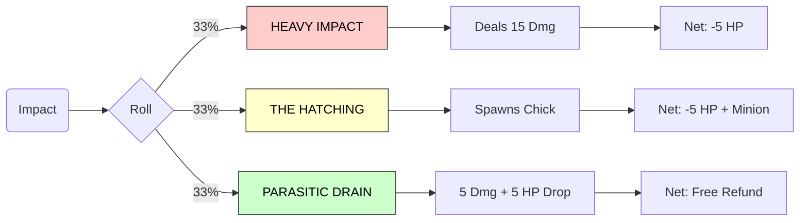

# Game Design Document: Health-Attack Linked Dungeon Crawler

## Core Concept

A **Binding of Isaac-style dungeon crawler** where **health is your ammunition**. Every shot costs life, but precision and collection allow you to reclaim it. The central design question: *How aggressively can you play before you run out of life to spend?*

Unlike traditional dungeon crawlers where ammo is managed separately (or infinite), Pizak forces you to spend your life force to attack. This creates a constant tension between aggression and survival.

### The Loop

1. **Attack (Spend Life)**: Every projectile you fire costs a portion of your health (default: 20 HP / 1 segment).
2. **Impact (Create Resource)**: When your projectile hits a wall or reaches its max range, it doesn't disappear. It physically drops as a **Pickup**.
3. **Collect (Reclaim Life)**: Running over the dropped pickup restores a percentage of the spent health (default: 80-100%).

### Strategic Implications

- **Aggression is expensive**: Spraying and praying will drain your life to zero in seconds.
- **Accuracy is paramount**: Missing a shot isn't just a lost opportunity; it's a temporary loss of HP until you retrieve the bullet.
- **Positioning matters**: Fighting near walls allows you to quickly reclaim missed shots. Fighting in open space makes retrieval dangerous.

## Current State (Implemented Features)

### Core Mechanics

1. **Twin-Stick Controls**:
    - **Move**: Left Stick (WASD/ESDF).
    - **Aim**: Right Stick (Arrows). Shows a dashed trajectory line.
    - **Fire**: Right Trigger (O). Costs **20 HP** (1 segment).
2. **Risk-Reward Cycle**:
    - **Shoot**: Lose 20 HP.
    - **Miss**: Projectile drops as a pickup on the ground.
    - **Hit**: Deal damage (HP effectively spent).
    - **Collect**: Recover ~80% of spent HP from pickups.
3. **Melee Attack (Vampiric)**:
    - Available when HP <= 20 (Critical).
    - Costs 10 HP but refunds health on hit (Vampiric).
    - High-risk option to recover from "out of ammo" states.

### Player Stats (Base Values)

```lua
max_hp = 100          -- 5 shots at full health
shot_cost = 20        -- HP per projectile fired
recovery_percent = 0.8 -- 80% return on pickups
regen_rate = 0        -- Passive regen is DISABLED (must clear rooms to heal)
room_clear_heal = 0  -- No healing on room clear (must use drain mechanic)
```

### Visual Design

- **Health Bar**: 3-state segments (Green=Ready, Orange=Charging, Red=Empty).
- **Minimap**: Isaac-style scalable minimap with Fog of War and special icons (Boss, Treasure, Shop).
- **Visual Feedback**: Floating damage numbers, flash effects, screen shake.

## Architecture & Systems

### 1. Procedural Dungeon Generation

- **Algorithm**: Grid-based expansion with "Rule of One" (no loops).
- **Phases**: Expansion -> Specialization (Boss/Shop) -> Carving -> Obstacles.
- **Wave Patterns**: Enemies spawn in predefined formations (Ambush, Flank, Line) based on room difficulty.

### 2. Skull Pressure (Anti-Camping)

To prevent players from stalling to exploit mechanics:

- **Trigger**: Staying in a cleared room while hurt for too long (>7s).
- **Effect**: Spawns an invincible "Skull" enemy that chases the player.
- **Goal**: Forces the player to move to the next room.

### 3. Entity Architecture

- **Factory Pattern**: Data-driven entities defined in `game_config.lua`.
- **Collision**: Bitmask-based filtering with spatial hashing for performance.
- **Event Bus**: Pub/Sub system for decoupled UI and Logic updates.

## Future Plans

### Powerup Categories

- **Stat Modifiers**: "Efficient Shot" (Lower cost), "Heart Container" (Max HP).
- **On-Hit Effects**: "Explosive" (AoE), "Piercing" (Pass-through).
- **Risk Traits**: "Glass Cannon" (Low HP, High Damage).

### Room Variety

- **Treasure Rooms**: Guaranteed powerups.
- **Shops**: Trade HP (Max or Current) for items.
- **Boss Rooms**: Unique encounters gating progression.

## Design Principles

1. **Clarity**: The health bar must instantly convey "Can I shoot?".
2. **Stat-Driven**: Everything scales (Damage = Max HP * Ratio).
3. **Risk Management**: Overflow HP is a resource for trade/power, not just safety.

## Lore/mechanics explanation

The Player is the host of a "Symbiotic Chicken Parasite". The chicken uses the player's life force to reproduce. The egg shooting consumes player health.

The core tension is: the player hurts himself to create an army, and needs that army to hunt effectively so he can heal and do it again.

Here is a breakdown of the "Symbiotic Sacrifice" System for your MVP, focusing on 3 distinct DNA Strands (items) you can prototype.

The Core Mechanic: "Blood for Blood"
The Cost: Every shot takes a small chunk of Player HP (e.g., 5 HP).

The Goal: Find DNA that either makes your blood "cheaper" (Defense/Efficiency) or makes your chicks better at harvesting it back (Sustain/Lifesteal).

### Projectile Outcomes (Three-Way Roll)

Upon impact with ANY surface (Enemy, Wall, Floor), the egg undergoes a transformational roll with 3 equal probabilities:


