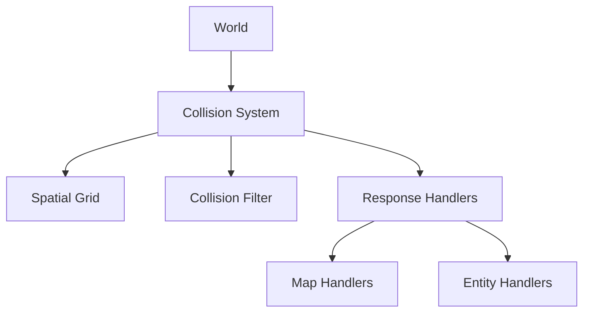

# Collision System

The collision system in Pizak is designed for high performance and clean separation of concerns, located in `src/physics/`.

## Architecture

### Components

1. **Collision (`src/physics/collision.lua`)**: The main entry point. Orchestrates the loop, spatial queries, and resolution logic.
2. **SpatialGrid (`src/physics/spatial_grid.lua`)**: A spatial partitioning optimization.
    - Divides the world into `64x64` pixel cells.
    - Entities are bucketed into cells based on their hitbox.
    - Queries only check entities in the same or adjacent cells, reducing checks from $O(N^2)$ to nearly $O(N)$.
3. **CollisionFilter (`src/physics/collision_filter.lua`)**: Bitmask-based filtering.
    - Defines layers: `PLAYER`, `ENEMY`, `PLAYER_PROJECTILE`, `ENEMY_PROJECTILE`, `PICKUP`, `WORLD`, `OBSTACLE`, `EXPLOSION`.
    - Quickly rejects invalid pairs (e.g., `EnemyProjectile` vs `Enemy`) using bitwise AND operations before any geometric checks.
    - **Note**: Handlers must be registered for both orderings (`"A,B"` and `"B,A"`) since collision check order depends on entity iteration.
4. **Handlers (`src/physics/handlers.lua`)**: Registry of collision responses.

## Resolution Pipeline

### 1. Entity-Entity Collision (`resolve_entities`)

Runs for every entity with the `collidable` tag.

1. **Spatial Query**: Get nearby potential colliders from `SpatialGrid`.
2. **Filter Check**: `CollisionFilter:can_collide(a, b)` checks layer masks.
3. **Overlap Check**: AABB (Axis-Aligned Bounding Box) intersection test.
    - *Special Case*: Fast projectiles uses **CCD (Continuous Collision Detection)** via raycasting against the target AABB to prevent tunneling.
4. **Handler Dispatch**: Looks up a handler key `"Type1,Type2"` (e.g., `"Player,Enemy"`).
5. **Execution**: Calls the handler function to apply damage, knockback, or effects.

### 2. Entity-Map Collision (`resolve_map`)

Runs for every entity with `map_collidable` and `velocity` tags.

1. **Axis Separation**: X and Y axes are resolved independently to allow sliding.
2. **Tile Lookup**: Checks tiles at the entity's future position.
3. **Solid Check**: `fget(tile, SOLID_FLAG)`.
    - *Exception*: Projectiles ignore `PIT_TILE` (flag checked in `find_solid_tile`).
4. **Resolution**:
    - If collision occurs, the entity stops (`vel = 0`).
    - Calls `Handlers.map[Type]` (e.g., destroy projectile, partial bounce).
    - **Door Guidance**: Players moving along walls near open doors are nudged into the doorway.

## Hitboxes (`src/utils/hitbox_utils.lua`)

Hitboxes are decoupled from sprite size.

- Defined in `GameConstants` per entity type.
- `get_hitbox(entity)` returns world-space coordinates `{x, y, w, h}`.
- Supports directional hitboxes (e.g., vertical vs horizontal laser) via `entity.hitbox[direction]`.
