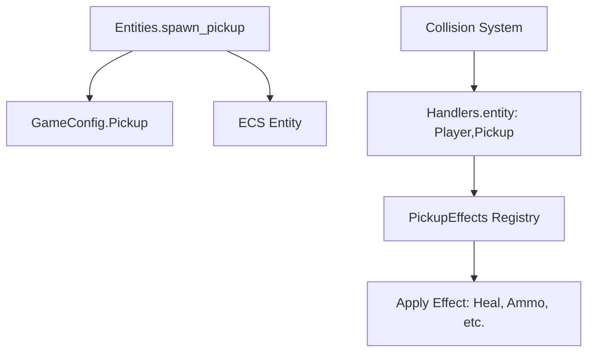

# Pickup System

The pickup system handles collectible items (hearts, coins, ammo) using a flexible **Type Object** pattern and a **decoupled effect registry**.

## Architecture



### 1. Configuration (`src/game/game_config.lua`)

Pickups are defined as pure data objects in `GameConstants.Pickup`. This separates data from logic.

```lua
HealthPickup = {
   entity_type = "HealthPickup",
   tags = "pickup,collidable,drawable,...",
   pickup_effect = "health", -- Key for effect registry
   recovery_amount = 20,     -- Data passed to effect handler
   sprite_index = 21,
   width = 16, height = 16,
   hitbox_width = 12, ...
}
```

### 2. Factory (`src/entities/pickup.lua`)

The factory instantiates pickup entities using the config. It supports:

- **Static Sprites**: Standard items (hearts, keys).
- **Directional Sprites**: Items that maintain the orientation of their source (e.g., `ProjectilePickup` looks like the bullet that spawned it).
- **Z-Axis Inheritance**: Pickups can spawn in mid-air (inheriting `z` from projectiles) and fall to the ground using gravity (`velocity` tag).

### 3. Effect Registry (`src/physics/handlers.lua`)

Effects are decoupled from the entity itself. The collision handler looks up the function in `PickupEffects` using the `pickup.pickup_effect` string.

```lua
local PickupEffects = {}

PickupEffects.health = function(player, pickup)
   local amount = pickup.recovery_amount or 10
   player.hp = min(player.hp + amount, player.max_hp)
   FloatingText.spawn(player, amount, "heal")
end
```

## Implemented Types

| Type | Trigger | Effect | Visuals |
| :--- | :--- | :--- | :--- |
| **ProjectilePickup** | Player projectile hits wall/range limit. | Restores Ammo (Health) | Inherits bullet sprite & direction. Falls to ground. |
| **HealthPickup** | Random drop from enemies/rocks. | Heals Player | Static heart sprite (21). |

## Adding New Pickups

1. **Define Data**: Add entry to `GameConstants.Pickup` (e.g., `Coin`).
2. **Define Logic**: Add handler to `PickupEffects` in `handlers.lua` (e.g., `PickupEffects.coin`).
3. **Spawn**: Use `Entities.spawn_pickup(world, x, y, "Coin")`.
